# Kelompok 8 - GitTrend: Monitor Repositori Open Source Populer

## Anggota Kelompok

| Nama                       | NRP        | Komponen                               |
|----------------------------|------------|----------------------------------------|
| Syifa Nurul Alfiah         | 5027241019 | Komponen 1 - Ingestion Layer (Kafka)   |
| Nisrina Bilqis             | 5027241054 | Komponen 2 - Storage Layer (HDFS)      |
| Revalina Erica Permatasari | 5027241007 | Komponen 3 - Processing Layer (Spark)  |
| Azaria Raissa Maulidinnisa | 5027241043 | Komponen 4 - Serving Layer (Dashboard) |

**Topik 7 — GitTrend: Monitor Repositori Open Source Populer**

**Pertanyaan bisnis:** Bahasa pemrograman apa yang paling tren minggu ini, dan tema proyek apa yang paling banyak digemari developer?

**Justifikasi topik:** GitHub adalah pusat aktivitas open source global. Dengan memantau repositori trending secara real-time, newsletter teknologi bisa mengkurasi konten yang relevan dan aktual untuk pembacanya tanpa harus melakukan riset manual setiap minggu.

---

## Arsitektur Pipeline

```
[GitHub API]     → producer-api → Topic: github-api ─┐
                                                       ├→ consumer-hdfs ─┬→ HDFS → Spark → spark_results.json ─┐
[TechCrunch RSS] → producer-rss → Topic: github-rss ─┘                  └→ live JSON (api+rss) ────────────────┴→ Dashboard
```

Semua komponen berjalan sebagai Docker container dalam satu network `gittrend-net`.

### Diagram Arsitektur

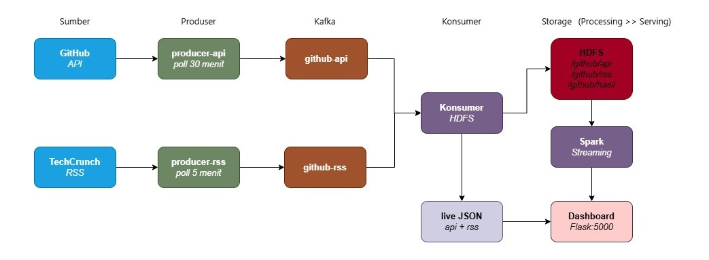

### Container yang Berjalan

| Container      | Image                                      | Port  | Fungsi                          |
|----------------|--------------------------------------------|-------|---------------------------------|
| zookeeper      | confluentinc/cp-zookeeper:7.5.0            | -     | Koordinator Kafka               |
| kafka          | confluentinc/cp-kafka:7.5.0               | 9092  | Message broker                  |
| kafka-init     | confluentinc/cp-kafka:7.5.0               | -     | Buat topic (run once)           |
| namenode       | bde2020/hadoop-namenode:2.0.0-hadoop3.2.1 | 9870  | HDFS NameNode                   |
| datanode       | bde2020/hadoop-datanode:2.0.0-hadoop3.2.1 | -     | HDFS DataNode                   |
| hdfs-init      | bde2020/hadoop-namenode:2.0.0-hadoop3.2.1 | -     | Buat direktori HDFS (run once)  |
| producer-api   | python:3.11-slim                           | -     | Poll GitHub API → Kafka         |
| producer-rss   | python:3.11-slim                           | -     | Poll RSS → Kafka                |
| consumer-hdfs  | python:3.11-slim                           | -     | Kafka → HDFS + live JSON        |
| spark          | apache/spark:3.5.3                         | -     | Structured Streaming → analisis |
| dashboard      | python:3.11-slim                           | 5000  | Flask dashboard                 |

---

## Struktur Repository

```
kelompok-8-ets-bigdata/
├── docker-compose-hadoop.yml  ← infrastruktur Hadoop (namenode, datanode, hdfs-init)
├── docker-compose-kafka.yml   ← Kafka + semua service aplikasi
├── hadoop.env
├── README.md
├── kafka/
│   ├── Dockerfile.producer
│   ├── producer_api.py        ← Komponen 1
│   ├── producer_rss.py        ← Komponen 1
│   └── consumer_to_hdfs.py   ← Komponen 2
├── spark/
│   ├── Dockerfile.spark
│   └── streaming_analysis.py ← Komponen 3
├── dashboard/
│   ├── Dockerfile.dashboard
│   ├── app.py                 ← Komponen 4
│   ├── templates/
│   │   └── index.html
│   └── data/                  ← di-mount dari host (auto-update)
│       ├── spark_results.json
│       ├── live_api.json
│       └── live_rss.json
└── documentation/
    ├── 1.jpg   ← diagram arsitektur
    ├── 2.png   ← HDFS Web UI
    ├── 3.png   ← Kafka topics list + consumer output
    ├── 4.png   ← HDFS ls -R
    ├── 5.png   ← HDFS du -h
    ├── 6.png   ← Spark logs
    ├── 7.png
    ├── 8.png   ← Health endpoint
    ├── 9.png   ← Dashboard
    ├── 10.png
    └── 11.png
```

---

## Cara Menjalankan

### Prasyarat
- Docker Desktop (Windows/Mac) atau Docker Engine + Compose (Linux)
- Minimal RAM: **8 GB** (HDFS + Spark butuh resource cukup besar)

### Langkah 1 — Clone repository
```bash
git clone https://github.com/revaerica/kelompok-8-ets-bigdata
cd kelompok-8-ets-bigdata
```

### Langkah 2 — Buat network Docker (wajib, harus dilakukan sebelum menjalankan compose)
```bash
docker network create gittrend-net
```
> Jika muncul error `network already exists`, abaikan — lanjut ke langkah berikutnya.

### Langkah 3 — Jalankan Hadoop terlebih dahulu
```bash
docker compose -f docker-compose-hadoop.yml up -d
```
Tunggu sekitar 30 detik hingga HDFS siap. Cek di `http://localhost:9870` — pastikan **Live Nodes: 1** dan Safemode off.

### Langkah 4 — Hubungkan Hadoop ke network gittrend-net
```bash
docker network connect gittrend-net namenode
docker network connect gittrend-net datanode
```
> Langkah ini wajib agar Spark dan consumer-hdfs bisa berkomunikasi dengan HDFS.

### Langkah 5 — Jalankan Kafka + semua service aplikasi
```bash
docker compose -f docker-compose-kafka.yml up --build -d
```
Build pertama kali membutuhkan beberapa menit karena mengunduh dependency Spark dan Python packages.

### Langkah 6 — (Opsional) Isi GitHub PAT untuk rate limit lebih longgar
Edit `docker-compose-kafka.yml`, cari service `producer-api`, ubah:
```yaml
GITHUB_PAT: ""   # ← isi Personal Access Token GitHub di sini
```
Kemudian restart service:
```bash
docker compose -f docker-compose-kafka.yml up -d producer-api
```

### Langkah 7 — (Opsional) Copy dataset Kaggle untuk seed data awal
Dataset CSV sudah tersedia di folder `data-set/` pada repo ini:
```bash
cp data-set/github_trending_repos.csv kafka/
```

### Langkah 8 — Cek status semua container
```bash
docker compose -f docker-compose-hadoop.yml ps
docker compose -f docker-compose-kafka.yml ps
```
Semua container harus berstatus `running`. `kafka-init` dan `hdfs-init` akan `exited` setelah selesai — itu **normal**.

### Langkah 9 — Akses dashboard
Buka browser: **http://localhost:5000**

Dashboard akan mulai menampilkan data setelah ±2 menit (Spark perlu waktu warm-up dan koneksi ke Kafka).

---

## Cara Verifikasi Tiap Komponen

### Kafka — Cek topic dan event
```bash
# Daftar topic
docker exec kafka kafka-topics --list --bootstrap-server localhost:9092

# Lihat event masuk ke topic API (5 pesan pertama)
docker exec kafka kafka-console-consumer \
  --topic github-api --from-beginning \
  --bootstrap-server localhost:9092 \
  --max-messages 5

# Cek consumer group
docker exec kafka kafka-consumer-groups \
  --describe --group hdfs-writer-api \
  --bootstrap-server localhost:9092
```

### HDFS — Cek file tersimpan
```bash
# Lihat isi direktori
docker exec namenode hdfs dfs -ls -R /data/github/

# Lihat ukuran per direktori
docker exec namenode hdfs dfs -du -h /data/github/
```

HDFS Web UI: **http://localhost:9870**

### Spark — Cek log streaming
```bash
docker logs -f spark
```
Setiap 60 detik akan muncul log seperti:
```
[spark] Batch #3 — 45 event masuk
[spark] Total historis dari HDFS: 1234 record
[spark] spark_results.json diupdate — 1234 repo
```

### Dashboard — Cek health endpoint
```bash
curl http://localhost:5000/api/health
# {"files":{"live_api.json":true,"live_rss.json":true,"spark_results.json":true},"status":"ok"}
```

---

## Dokumentasi

### HDFS Web UI
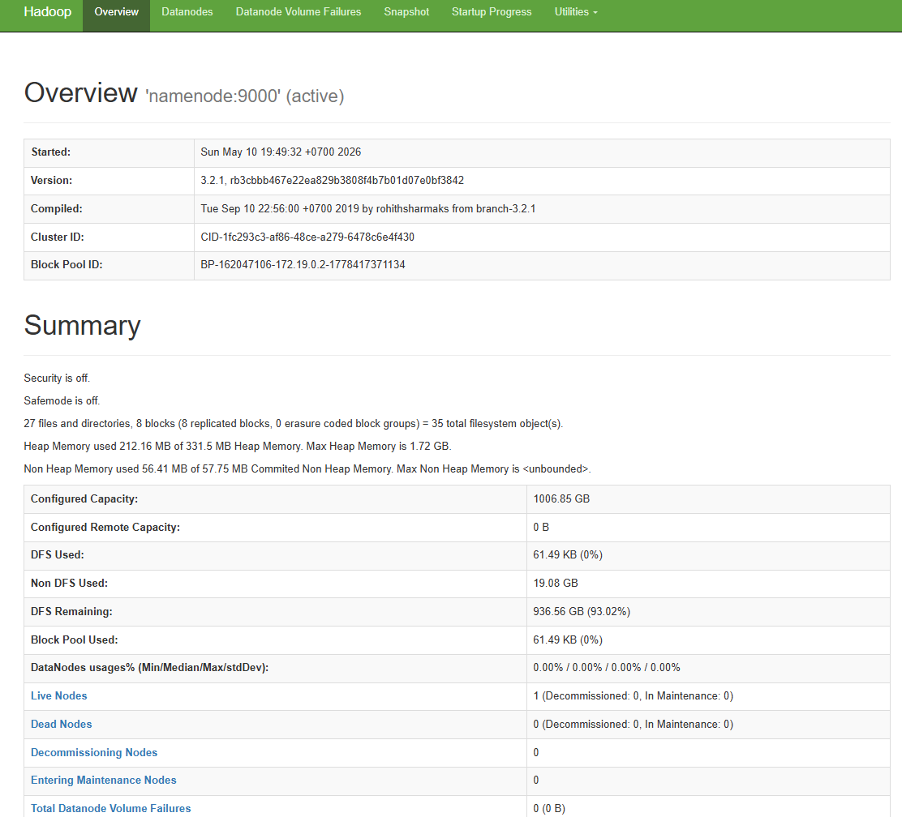

HDFS berjalan dengan **Live Nodes: 1**, Safemode off, dan data sudah tersimpan (DFS Used > 0).

### Kafka — Topics List & Consumer Output
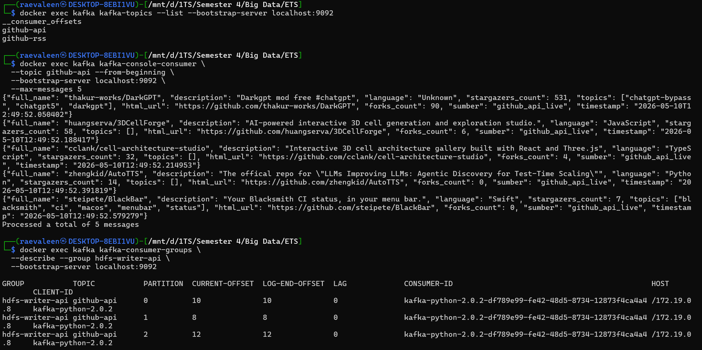

Dua topic `github-api` dan `github-rss` berhasil dibuat. Event JSON dari GitHub API masuk dengan format konsisten. Consumer group `hdfs-writer-api` terdaftar dengan LAG = 0 (semua pesan sudah diproses).

### HDFS — Struktur Direktori
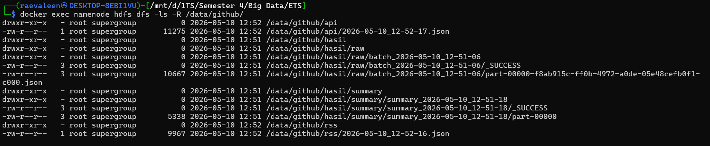

File JSON tersimpan di `/data/github/api/`, `/data/github/rss/`, dan output Spark di `/data/github/hasil/`.

### HDFS — Ukuran Data
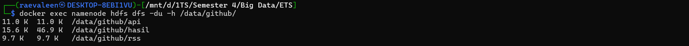

### Spark — Streaming Logs
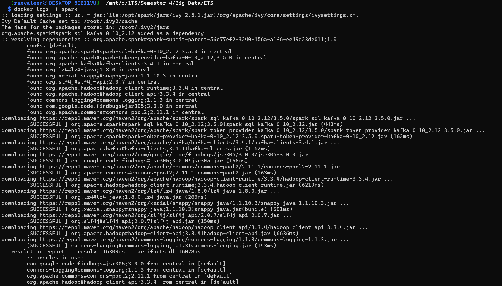
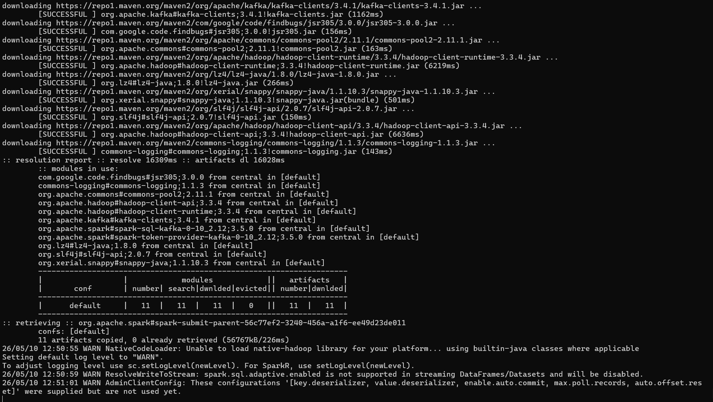

Spark Structured Streaming berjalan otomatis, mendownload dependency Kafka connector dan terhubung ke topic `github-api`.

### Dashboard & Health Check
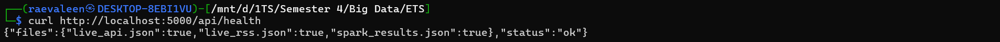

Semua 3 file data terdeteksi (`live_api.json`, `live_rss.json`, `spark_results.json`) dengan status `ok`.

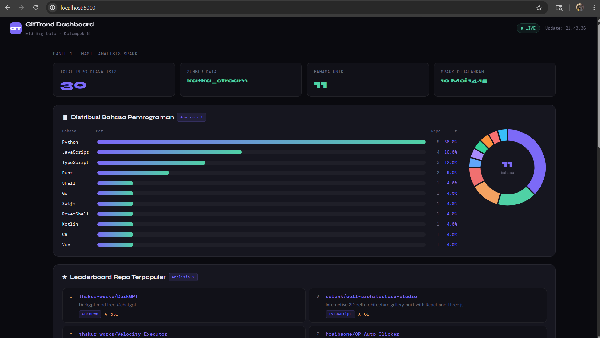

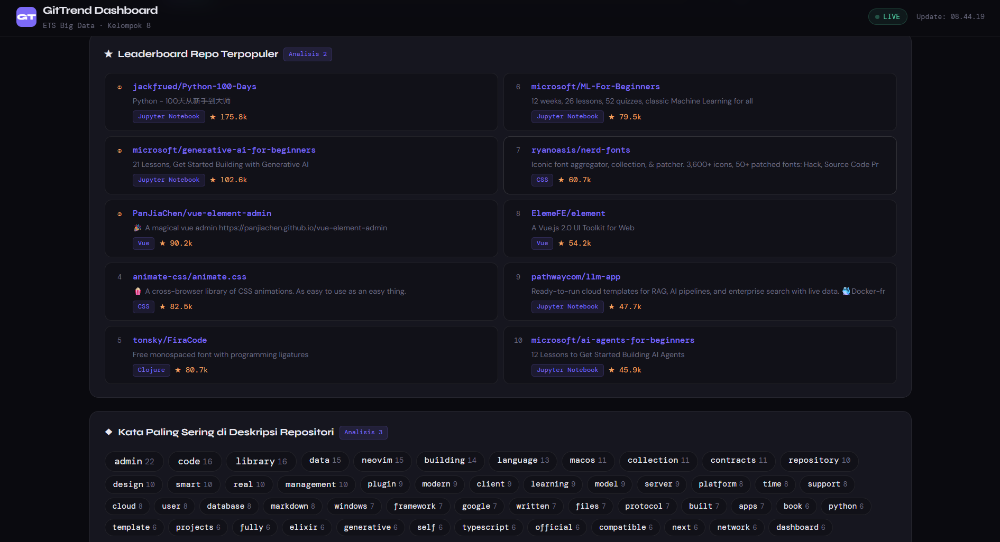

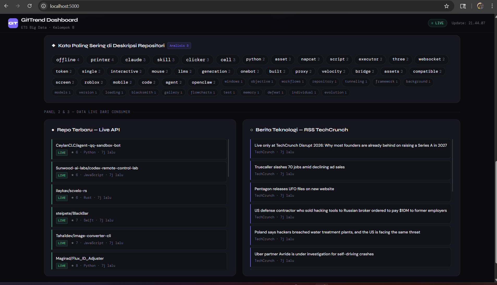

---

## Hasil Analisis Spark

### Analisis 1 — Distribusi Bahasa Pemrograman
Dari 30 repositori yang dianalisis, Python mendominasi dengan 8 repo (27%), diikuti TypeScript 5 repo (17%) dan JavaScript 4 repo (13%). Dominasi Python mencerminkan tren ekosistem AI/ML yang masih sangat aktif, mayoritas project LLM wrapper dan agent framework ditulis dalam Python. Menariknya, meski jumlah repo JavaScript lebih sedikit dari TypeScript, rata-rata bintangnya lebih tinggi (60 vs 21), menunjukkan repo JavaScript yang ada cenderung lebih established. Kotlin dan PowerShell muncul dengan rata-rata bintang tertinggi (162 dan 121) meski hanya 1 repo masing-masing.

### Analisis 2 — Top 10 Repositori Berdasarkan Bintang
thakur-works/DarkGPT memimpin dengan 531 ⭐, diikuti Velocity-Executor (528 ⭐) dan 3DCellForge (169 ⭐). Menarik bahwa dua repo teratas berlabel bahasa "Unknown" yang mengindikasikan banyak repositori trending tidak mencantumkan bahasa utama secara eksplisit. Tema yang dominan adalah tooling (executor, auto-clicker, DNS client) dan proyek berbasis AI/3D interaktif, yang relevan sebagai bahan kurasi untuk newsletter teknologi mingguan.

### Analisis 3 — Kata Paling Sering di Deskripsi Repo
Kata "offline" dan "printer" muncul paling sering (4x), diikuti "claude", "skill", "clicker", "cell", dan "agent" (3x masing-masing). Kemunculan kata "agent", "llms", dan "token" mengkonfirmasi dominasi tema AI/agentic framework di repositori trending. Sementara "roblox", "executor", dan "clicker" menunjukkan segmen gaming/automation tools yang cukup aktif di GitHub pada periode pengambilan data ini.

---

## Stop dan Cleanup

```bash
# Stop semua container
docker compose -f docker-compose-kafka.yml down
docker compose -f docker-compose-hadoop.yml down

# Stop + hapus volume (data HDFS hilang)
docker compose -f docker-compose-kafka.yml down
docker compose -f docker-compose-hadoop.yml down -v
```

---

## Tantangan dan Solusi

| Tantangan | Solusi |
|-----------|--------|
| Startup ordering (Kafka/HDFS belum siap) | `sleep` + retry loop di setiap service; `depends_on` untuk urutan dasar |
| Spark Structured Streaming + HDFS read/write | Gunakan `foreachBatch` + baca historis HDFS kumulatif per batch |
| Dashboard realtime tanpa polling HDFS langsung | Spark tulis ke shared volume `/app/data`, Flask baca dari situ |
| Rate limit GitHub API | Interval 30 menit; support PAT via env variable |
| File kecil di HDFS | Buffer 50 event atau 2 menit sebelum flush |
| Cross-file Docker network | Network `gittrend-net` dibuat manual dulu, lalu namenode & datanode di-connect manual sebelum menjalankan kafka compose |
| Spark checkpoint gagal ke HDFS | Ganti checkpoint location ke local `/tmp/spark-ckpt-local` agar tidak bergantung pada HDFS |
| `enable_idempotence` tidak dikenali kafka-python | Hapus parameter tersebut dari inisialisasi KafkaProducer |
