# README Lakehouse — GitTrend Data Lakehouse
**Kelompok 8 | Tugas Week 12 | Big Data**

---

## Arsitektur: Sebelum vs Sesudah

### Sebelum (ETS)
```
[GitHub API] → Kafka → consumer_to_hdfs → HDFS (JSON mentah)
[RSS Feed]   → Kafka → consumer_to_hdfs → HDFS (JSON mentah)
                                               ↓
                                    Spark Structured Streaming
                                    (baca JSON, analisis, simpan JSON)
                                               ↓
                                    spark_results.json → Dashboard Flask
```

**Masalah arsitektur lama:**
- Data di HDFS adalah JSON mentah tanpa schema enforcement
- Tidak ada ACID — jika proses gagal di tengah jalan, data bisa korup
- Tidak ada versioning — tidak bisa tahu data berubah kapan dan oleh siapa
- Duplikat repo tidak terdeteksi → analisis tidak akurat
- Timestamp masih String → tidak bisa pakai Window Function

### Sesudah (Lakehouse)
```
[GitHub API] → Kafka → consumer_to_hdfs → HDFS (JSON mentah)
[RSS Feed]   → Kafka → consumer_to_hdfs → HDFS (JSON mentah)
                                               ↓
                                    🥉 BRONZE (Delta Lake)
                                    Raw data + metadata _ingested_at, _source
                                               ↓
                                    🥈 SILVER (Delta Lake)
                                    Cleaned: dedup, cast types, filter invalid
                                    + Time Travel + Schema Evolution
                                               ↓
                                    🥇 GOLD (Delta Lake)
                                    language_dist | top_repos
                                    star_velocity | emerging_topics
                                    api_rss_join (cross-source)
                                               ↓
                                    Dashboard Flask (port 5001)
                                    /api/gold → Gold Delta Lake
```

---

## Cara Menjalankan Pipeline Lakehouse

### Prasyarat
- Docker Desktop berjalan
- Container ETS sudah aktif
- Volume sudah ditambahkan pada service `spark` di `docker-compose-kafka.yml`:

```yaml
volumes:
  - ./dashboard/data:/app/data
  - ./lakehouse:/app/lakehouse
```

### Langkah 1 — Pastikan container ETS aktif

```bash
docker network create gittrend-net
docker compose -f docker-compose-hadoop.yml up -d
docker network connect gittrend-net namenode
docker network connect gittrend-net datanode
docker compose -f docker-compose-kafka.yml up --build -d
```

Tunggu ~2 menit hingga data terkumpul di HDFS.

### Langkah 2 — Jalankan script secara berurutan

```bash
docker exec -it spark bash
cd /app/lakehouse
pip install delta-spark==3.1.0 importlib_metadata
python3 01_bronze.py
python3 02_silver.py
python3 03_gold.py
```

### Langkah 3 — Akses dashboard Gold

Buka browser: **http://localhost:5001**

---

## Dokumentasi Pipeline

### Setup & Bronze Layer

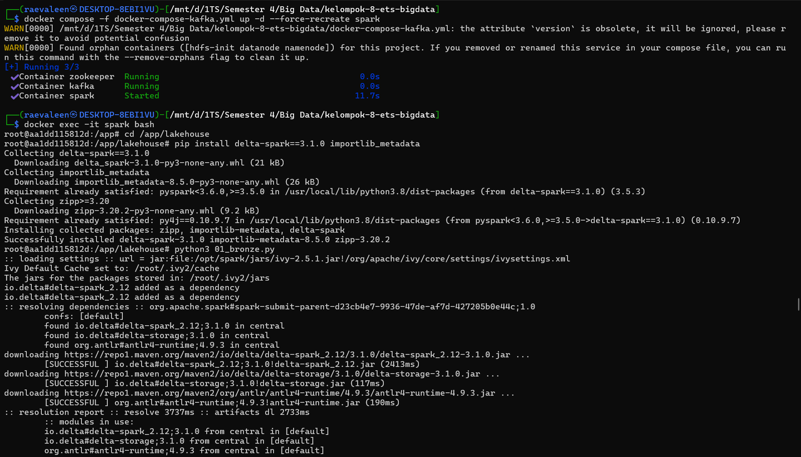
*force-recreate spark container, pip install, lalu python3 01_bronze.py*

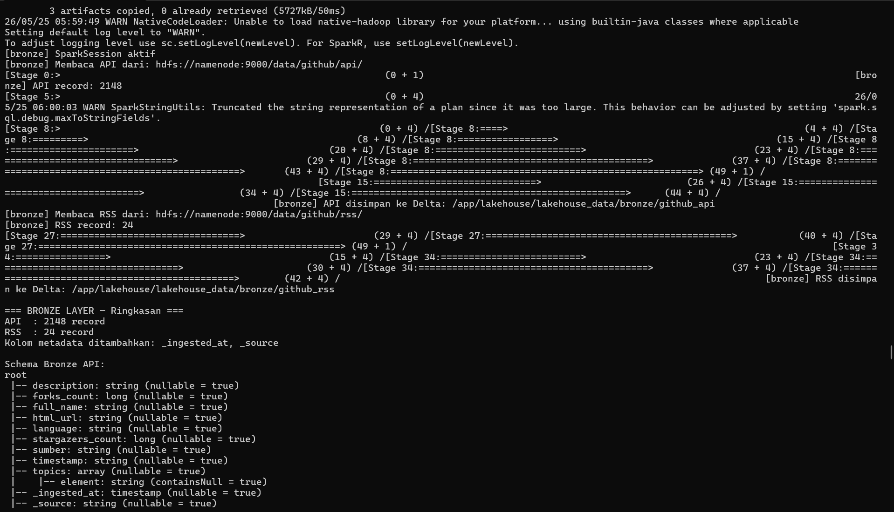
*Bronze berhasil: 2148 record API + 24 record RSS dari HDFS, disimpan ke Delta Lake dengan schema lengkap*

```
=== BRONZE LAYER — Ringkasan ===
API  : 2148 record
RSS  : 24 record
Kolom metadata ditambahkan: _ingested_at, _source
```

Schema Bronze API:
```
root
 |-- description: string (nullable = true)
 |-- forks_count: long (nullable = true)
 |-- full_name: string (nullable = true)
 |-- html_url: string (nullable = true)
 |-- language: string (nullable = true)
 |-- stargazers_count: long (nullable = true)
 |-- sumber: string (nullable = true)
 |-- timestamp: string (nullable = true)
 |-- topics: array (nullable = true)
 |    |-- element: string (containsNull = true)
 |-- _ingested_at: timestamp (nullable = true)
 |-- _source: string (nullable = true)
```

---

### Silver Layer — Cleaning, Time Travel & Schema Evolution

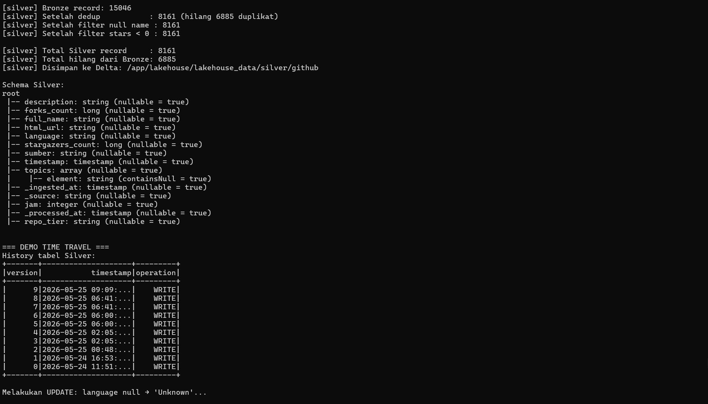
*Silver memproses 11639 Bronze record → 6946 Silver (hilang 4693 duplikat berdasarkan full_name + _ingested_at)*

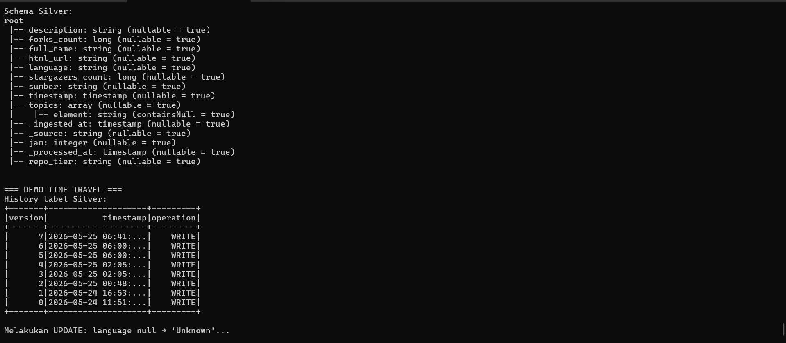
*Schema Silver lengkap dengan kolom jam dan _processed_at. History tabel Silver menunjukkan 9 versi (v0–v8)*

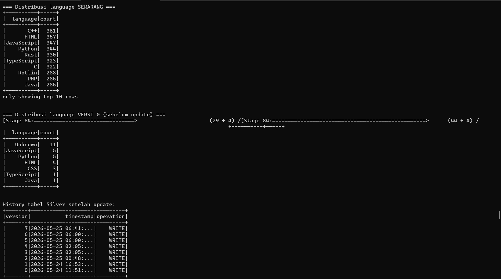
*Time Travel: distribusi language sekarang (C++ 361, HTML 357) vs versi 0 (Unknown 11, JavaScript 5)*

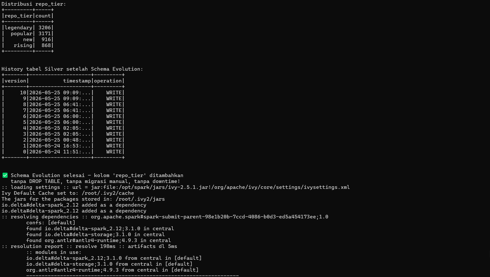
*Demo Schema Evolution: kolom repo_tier ditambahkan ke Silver tanpa DROP TABLE menggunakan mergeSchema=True*

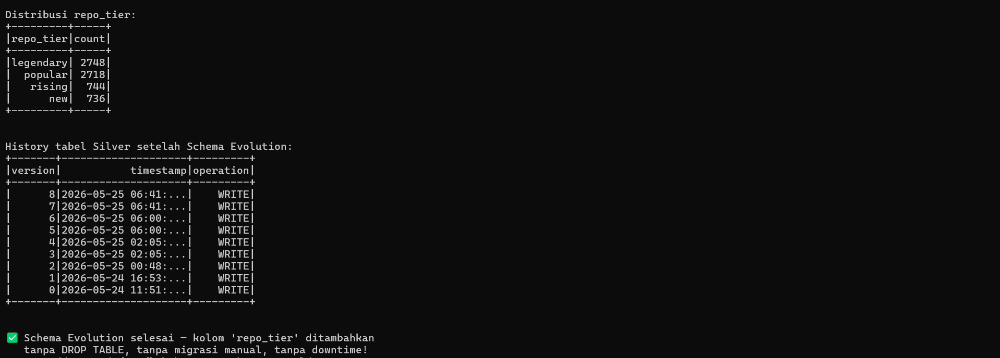
*Distribusi repo_tier: legendary 2748, popular 2718, rising 744, new 736. History Silver setelah Schema Evolution: versi 8*

Silver berhasil memproses **11639 Bronze record** menjadi **6946 record bersih** —
menghapus 4693 duplikat. Data disimpan ke `/app/lakehouse/lakehouse_data/silver/github`.

```
[silver] Bronze record: 11639
[silver] Setelah dedup           : 6946 (hilang 4693 duplikat)
[silver] Setelah filter null name : 6946
[silver] Setelah filter stars < 0 : 6946

[silver] Total Silver record     : 6946
[silver] Total hilang dari Bronze: 4693
```

> **Catatan penting:** Dedup Silver sekarang menggunakan `dropDuplicates(["full_name", "_ingested_at"])` — bukan hanya `full_name`. Ini mempertahankan observasi multi-waktu untuk kalkulasi `lag()` di Gold layer (star_velocity), sementara tetap menghapus duplikat dalam batch yang sama.

Demo Time Travel berhasil — tabel Silver punya 9 versi (v0–v8):

```
History tabel Silver:
+-------+--------------------+---------+
|version|           timestamp|operation|
+-------+--------------------+---------+
|      8|2026-05-25 06:41:...|    WRITE|
|      7|2026-05-25 06:41:...|    WRITE|
|      ...                            |
|      0|2026-05-24 11:51:...|    WRITE|
+-------+--------------------+---------+
```

---

### Gold Layer — Agregasi, Enhanced Analysis & Cross-source Join

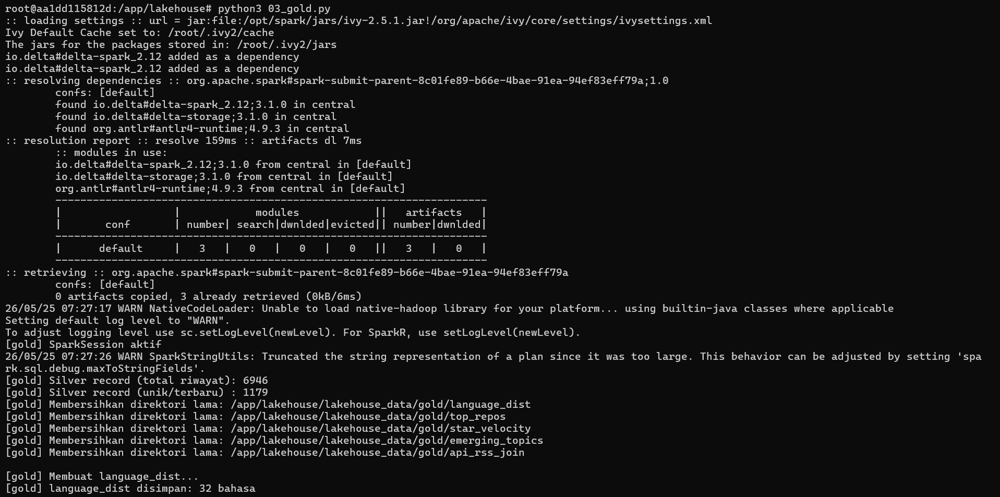
*Gold mulai, Silver record: 6946 total riwayat / 1179 unik terbaru. language_dist: 32 bahasa disimpan*

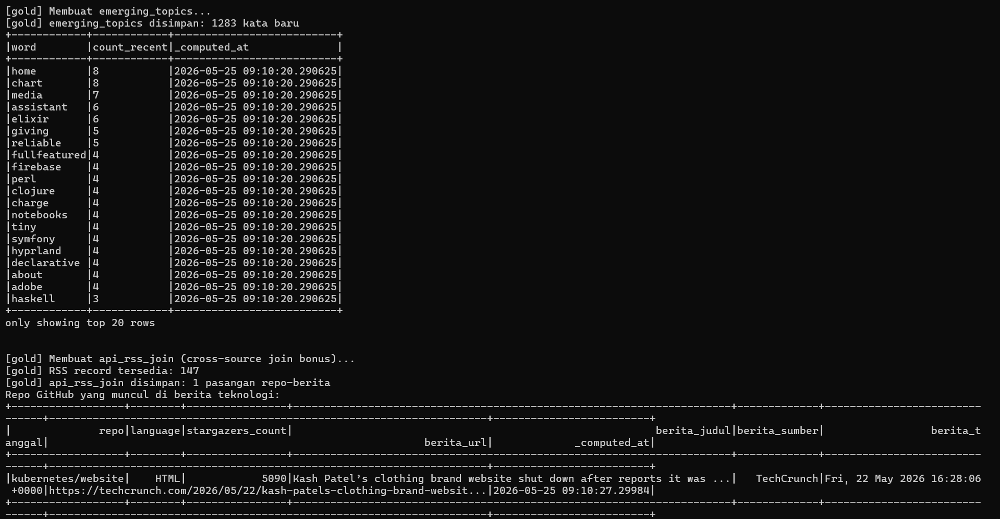
*Tabel language_dist: HTML memimpin (67 repo), diikuti C++ (62) dan JavaScript (60). Top_repos disimpan*

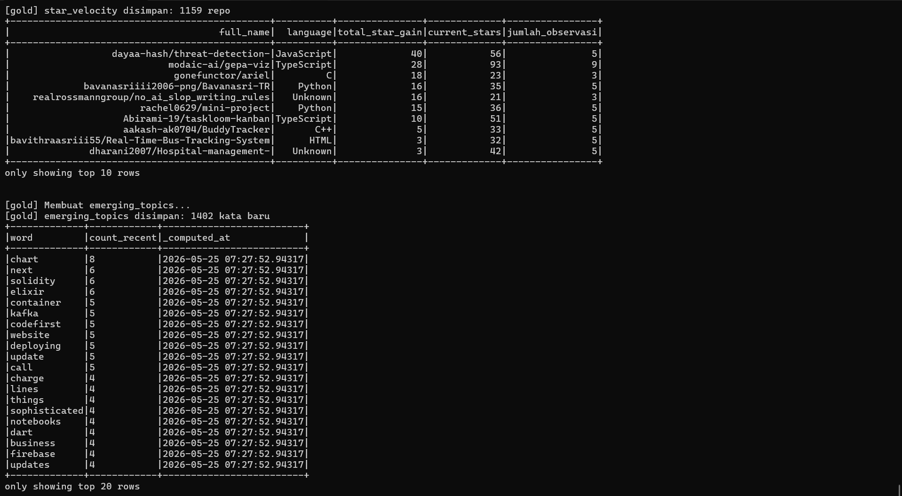
*star_velocity: 1159 repo (berhasil karena multi-sesi). emerging_topics: 1402 kata baru*

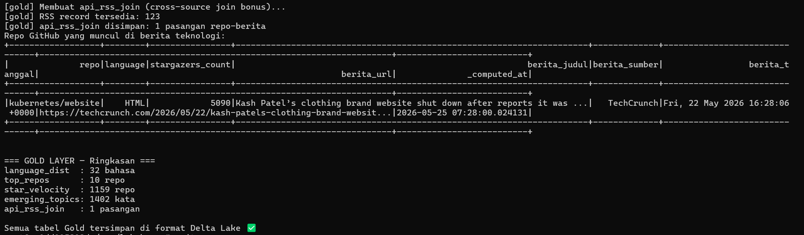
*api_rss_join: 1 pasangan (kubernetes/website × berita TechCrunch). Gold layer selesai ✅*

```
=== GOLD LAYER — Ringkasan ===
language_dist  : 32 bahasa
top_repos      : 10 repo
star_velocity  : 1159 repo
emerging_topics: 1402 kata
api_rss_join   : 1 pasangan

Semua tabel Gold tersimpan di format Delta Lake ✅
```

**language_dist** — Top 15 bahasa dari 1179 repo unik:

| language | jumlah_repo | rata_rata_bintang | total_bintang |
|----------|------------|-------------------|---------------|
| HTML | 67 | 7592.0 | 508656 |
| C++ | 62 | 20212.0 | 1253130 |
| JavaScript | 60 | 22198.0 | 1331870 |
| Python | 60 | 14240.0 | 854401 |
| TypeScript | 56 | 34995.0 | 1959726 |

**top_repos** — Top 10 repo berdasarkan bintang:

| full_name | language | stargazers_count |
|-----------|----------|-----------------|
| freeCodeCamp/freeCodeCamp | TypeScript | 434010 |
| jackfrued/Python-100-Days | Jupyter Notebook | 175767 |
| flutter/flutter | Dart | 174112 |
| airbnb/javascript | JavaScript | 147946 |
| yangshun/tech-interview-handbook | TypeScript | 135805 |

**star_velocity** — Top repo paling viral:

| full_name | language | total_star_gain | current_stars |
|-----------|----------|----------------|---------------|
| dayaa-hash/threat-detection- | JavaScript | 40 | 56 |
| modaic-ai/gepa-viz | TypeScript | 28 | 93 |
| gonefunctor/ariel | C | 18 | 23 |

**emerging_topics** — Top kata kunci baru (jam terbaru):

| word | count_recent |
|------|-------------|
| chart | 8 |
| solidity | 6 |
| next | 6 |
| elixir | 6 |
| container | 5 |

---

### Dashboard Gold (http://localhost:5001)

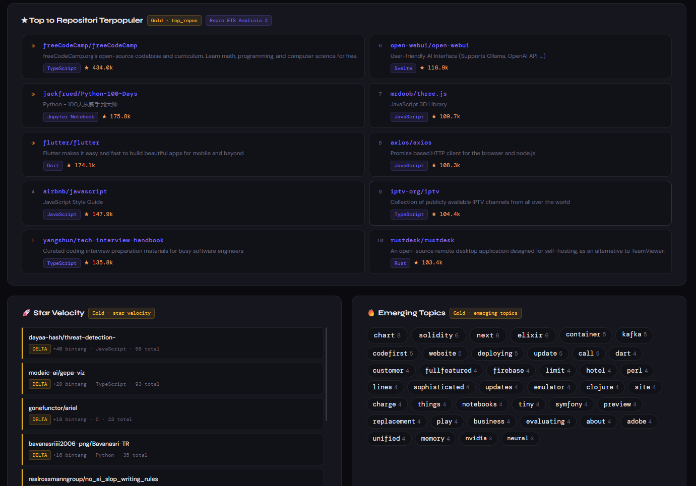
*Dashboard Gold menampilkan distribusi 32 bahasa dengan bar chart + donut chart. Total 1.2k repo, 17.0M bintang*

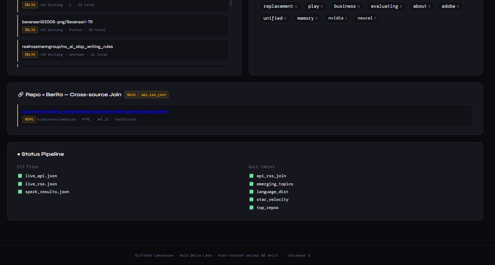
*Top 10 repo terpopuler dalam 2 kolom, star velocity 1159 repo, emerging topics word cloud, status pipeline semua ✅*

---

## Penjelasan Transformasi Silver

### Transformasi 1: Hapus Duplikat (`dropDuplicates(["full_name", "_ingested_at"])`)
**Mengapa:** Producer mengirim data dari dua sumber — seed dataset Kaggle dan live GitHub API. Repo yang sama bisa muncul beberapa kali dalam batch yang sama. Dedup menggunakan kombinasi `full_name + _ingested_at` untuk menghapus duplikat dalam batch yang sama, tapi mempertahankan observasi di waktu berbeda untuk kalkulasi `lag()` di Gold layer.
**Dampak: 4693 baris dihapus dari 11639 → 6946 record.**

### Transformasi 2: Filter `full_name` null
**Mengapa:** `full_name` adalah identifier utama setiap repo. Tanpa `full_name`, data tidak bisa diidentifikasi dan tidak berguna untuk analisis apapun.

### Transformasi 3: Filter `stargazers_count` negatif
**Mengapa:** Nilai bintang tidak mungkin negatif. Jika ada, itu adalah data korup dari sumber yang akan merusak hasil analisis rata-rata dan ranking.

### Transformasi 4: Cast `timestamp` String → `TimestampType`
**Mengapa:** Di ETS, timestamp disimpan sebagai String sehingga tidak bisa digunakan untuk Window Function (`lag`, `lead`) atau filter per jam.

### Transformasi 5: Fill null `language` → "Unknown"
**Mengapa:** Banyak repo tidak mencantumkan bahasa utama. Dengan mengisinya sebagai "Unknown", kita tetap bisa melacak proporsi repo yang tidak terklasifikasi.

### Transformasi 6: Ekstrak kolom `jam` dari timestamp
**Mengapa:** Memudahkan analisis per jam tanpa parsing ulang timestamp. Digunakan untuk `emerging_topics`.

| Transformasi | Baris Hilang | Alasan |
|---|---|---|
| Hapus duplikat | 4693 baris | Repo dikirim duplikat dalam batch yang sama |
| Filter full_name null | 0 baris | Semua event dari Kafka sudah punya full_name |
| Filter stars negatif | 0 baris | Tidak ada data korup dari sumber |

---

## Tabel Gold — Perbandingan vs Analisis ETS

### Gold 1: `language_dist` (Repro Analisis 1 ETS)

| Aspek | ETS (Spark Streaming) | Gold Layer |
|---|---|---|
| Sumber | JSON mentah HDFS | Silver Delta (sudah bersih) |
| Duplikat | Ada → jumlah tidak akurat | Sudah dihapus → akurat |
| Null handling | Filter saat query | Sudah dihandle di Silver |
| Jumlah bahasa | ~15 bahasa | 32 bahasa (lebih lengkap) |

### Gold 2: `top_repos` (Repro Analisis 2 ETS)

| Aspek | ETS (Spark Streaming) | Gold Layer |
|---|---|---|
| Ranking | Bisa ada repo duplikat di top 10 | Dedup sudah dilakukan → ranking bersih |
| Format | JSON flat | Delta format dengan schema ketat |
| Data | ~1.1k repo | 1179 repo unik terbaru |

### Gold 3: `star_velocity` ( Enhanced — Window Function)

Tidak bisa dibuat di ETS karena timestamp masih String. Berhasil menghasilkan **1159 repo** dengan data velocity karena Bronze dijalankan di beberapa sesi berbeda, menghasilkan observasi multi-waktu per repo.

### Gold 4: `emerging_topics` ( Enhanced — Cross-time analysis)

Menghasilkan **1402 kata emerging**. Kata "chart" paling sering muncul (8x), diikuti "solidity", "next", dan "elixir".

### Gold 5: `api_rss_join` ( Bonus — Cross-source Join)

Menghasilkan **1 pasangan**: `kubernetes/website` muncul di GitHub trending dan di berita TechCrunch tentang Kash Patel's clothing brand website.

---

## Demo Time Travel

```python
# Baca data SEBELUM update (versi 0 — hanya 30 repo awal)
spark.read.format("delta").option("versionAsOf", 0).load(silver_path)

# Baca data SESUDAH update (versi terkini — 6946 repo)
spark.read.format("delta").load(silver_path)
```

Tabel Silver punya **9 versi** (v0 dari 24 Mei hingga v8 dari 25 Mei), membuktikan audit trail Delta Lake berjalan sempurna lintas hari.

---

## Demo Schema Evolution

```python
silver_with_tier.write.format("delta") \
    .option("mergeSchema", "true") \
    .mode("overwrite") \
    .save(SILVER_GITHUB)
```

Kolom `repo_tier` ditambahkan tanpa DROP TABLE. Distribusi:
- legendary (>10k bintang): 2748 repo
- popular (>1k bintang): 2718 repo
- rising (>100 bintang): 744 repo
- new (≤100 bintang): 736 repo

---

## Refleksi: Keuntungan Delta Lake vs HDFS/JSON

| Aspek | HDFS JSON (ETS) | Delta Lake (Tugas) |
|---|---|---|
| **ACID** | ❌ Tidak ada | ✅ Atomik — commit all or nothing |
| **Versioning** | ❌ Tidak bisa lihat data versi lama | ✅ Time Travel ke versi manapun (9 versi tercatat) |
| **Schema** | ❌ Tidak ada enforcement | ✅ Schema konsisten + Schema Evolution |
| **Update/Delete** | ❌ Harus tulis ulang seluruh file | ✅ MERGE INTO, UPDATE, DELETE efisien |
| **Audit Trail** | ❌ Tidak tahu siapa ubah apa kapan | ✅ `_delta_log` mencatat semua operasi |
| **Query Performance** | ❌ Baca semua JSON satu per satu | ✅ Predicate pushdown via Parquet |
| **ML Reprodusibility** | ❌ Tidak bisa memastikan data yang sama | ✅ `versionAsOf` menjamin data identik |
| **Cross-source Analysis** | ❌ Susah join JSON dari sumber berbeda | ✅ Join Silver API + RSS di Gold layer |

**Kesimpulan:** Keuntungan paling nyata untuk GitTrend adalah kemampuan mendeteksi **4693 duplikat** secara terstruktur, Time Travel dengan **9 versi** yang bisa diakses kapanpun, Schema Evolution tanpa downtime, dan star_velocity yang berhasil menghasilkan **1159 repo** berkat multi-sesi Bronze.

---

## Struktur Folder

```
lakehouse/
├── README_lakehouse.md   ← Dokumentasi ini
├── 00_setup.md           ← Cara menjalankan
├── 01_bronze.py          ← Ingest HDFS → Bronze Delta
├── 02_silver.py          ← Cleaning + Time Travel + Schema Evolution
├── 03_gold.py            ← 5 tabel Gold (termasuk cross-source join)
├── app_gold.py           ← Dashboard Gold (Flask port 5001)
└── Dockerfile.lakehouse  ← Container untuk dashboard Gold
```

Data tersimpan di local filesystem (di-mount via Docker volume):
```
lakehouse/lakehouse_data/
├── bronze/github_api/        ← _delta_log/ + *.snappy.parquet
├── silver/github/            ← _delta_log/ + *.snappy.parquet (9 versi)
└── gold/
    ├── language_dist/        ← 32 bahasa
    ├── top_repos/            ← 10 repo
    ├── star_velocity/        ← 1159 repo
    ├── emerging_topics/      ← 1402 kata
    └── api_rss_join/         ← 1 pasangan repo-berita
```
