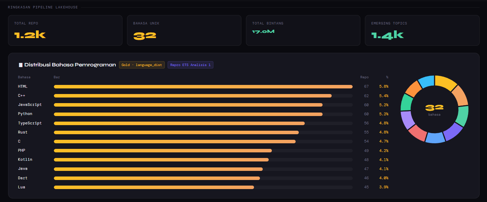

# README Lakehouse — GitTrend Data Lakehouse
**Kelompok 8 | Tugas Week 12 | Big Data**

---

## Arsitektur: Sebelum vs Sesudah

### Sebelum (ETS)
```
[GitHub API] → Kafka → consumer_to_hdfs → HDFS (JSON mentah)
[RSS Feed]   → Kafka → consumer_to_hdfs → HDFS (JSON mentah)
                                               ↓
                                    Spark Structured Streaming
                                    (baca JSON, analisis, simpan JSON)
                                               ↓
                                    spark_results.json → Dashboard Flask
```

**Masalah arsitektur lama:**
- Data di HDFS adalah JSON mentah tanpa schema enforcement
- Tidak ada ACID — jika proses gagal di tengah jalan, data bisa korup
- Tidak ada versioning — tidak bisa tahu data berubah kapan dan oleh siapa
- Duplikat repo tidak terdeteksi → analisis tidak akurat
- Timestamp masih String → tidak bisa pakai Window Function

### Sesudah (Lakehouse)
```
[GitHub API] → Kafka → consumer_to_hdfs → HDFS (JSON mentah)
[RSS Feed]   → Kafka → consumer_to_hdfs → HDFS (JSON mentah)
                                               ↓
                                    🥉 BRONZE (Delta Lake)
                                    Raw data + metadata _ingested_at, _source
                                               ↓
                                    🥈 SILVER (Delta Lake)
                                    Cleaned: dedup, cast types, filter invalid
                                    + Time Travel + Schema Evolution
                                               ↓
                                    🥇 GOLD (Delta Lake)
                                    language_dist | top_repos
                                    star_velocity | emerging_topics
                                    api_rss_join (cross-source)
                                               ↓
                                    Dashboard Flask (port 5001)
                                    /api/gold → Gold Delta Lake
```

---

## Cara Menjalankan Pipeline Lakehouse

### Prasyarat
- Docker Desktop berjalan
- File `docker-compose-kafka.yml` sudah menggunakan versi terbaru
  (sudah include service `lakehouse-pipeline` untuk otomasi Bronze→Silver→Gold)

### Langkah 1 — Jalankan container Hadoop

```bash
docker network create gittrend-net
docker compose -f docker-compose-hadoop.yml up -d
docker network connect gittrend-net namenode
docker network connect gittrend-net datanode
```

Tunggu ~30 detik hingga HDFS siap. Cek di `http://localhost:9870` — pastikan **Live Nodes: 1** dan Safemode off.

### Langkah 2 — Jalankan semua service

```bash
docker compose -f docker-compose-kafka.yml up --build -d
```

Selesai! Pipeline Bronze→Silver→Gold akan berjalan **otomatis** setiap 10 menit tanpa intervensi manual.

### Langkah 3 — Akses dashboard Gold

Buka browser: **http://localhost:5001**

---

## Yang Terjadi Secara Otomatis

Setelah `docker compose up`, semua service ini berjalan sendiri:

```
producer-api       → kirim data GitHub API ke Kafka (setiap 30 menit)
producer-rss       → kirim berita RSS ke Kafka (setiap 10 menit)
consumer-hdfs      → simpan data Kafka ke HDFS
spark              → analisis Spark Streaming (setiap 60 detik)
lakehouse-pipeline → Bronze → Silver → Gold (setiap 10 menit) ← BARU
dashboard          → tampilkan hasil Spark Streaming (port 5000)
lakehouse-dashboard→ tampilkan Gold Layer (port 5001)
```

Pantau pipeline berjalan otomatis:
```bash
docker logs -f lakehouse-pipeline
```

---

## Dokumentasi Pipeline

### Setup & Bronze Layer


*Container lakehouse-pipeline Started otomatis, delta-spark terinstall, pipeline menunggu 60 detik sebelum mulai*


*Bronze berhasil otomatis: 3407 record API + 24 record RSS dari HDFS, disimpan ke Delta Lake dengan schema lengkap*

```
=== BRONZE LAYER — Ringkasan ===
API  : 3407 record
RSS  : 24 record
Kolom metadata ditambahkan: _ingested_at, _source
```

Schema Bronze API:
```
root
 |-- description: string (nullable = true)
 |-- forks_count: long (nullable = true)
 |-- full_name: string (nullable = true)
 |-- html_url: string (nullable = true)
 |-- language: string (nullable = true)
 |-- stargazers_count: long (nullable = true)
 |-- sumber: string (nullable = true)
 |-- timestamp: string (nullable = true)
 |-- topics: array (nullable = true)
 |    |-- element: string (containsNull = true)
 |-- _ingested_at: timestamp (nullable = true)
 |-- _source: string (nullable = true)
```

---

### Silver Layer — Cleaning, Time Travel & Schema Evolution


*Silver memproses 15046 Bronze record → 8161 Silver (hilang 6885 duplikat). Schema Silver lengkap dengan kolom jam, _processed_at, dan repo_tier. History tabel Silver menunjukkan 10 versi (v0–v9)*


*Time Travel: distribusi language sekarang (HTML 430, C++ 423) vs versi 0 (Unknown 11, JavaScript 5). History tabel Silver setelah update tetap v0–v9*


*Demo Schema Evolution: Schema SEBELUM dan SESUDAH mergeSchema=True — kolom repo_tier dipertahankan tanpa DROP TABLE, tanpa downtime*


*Distribusi repo_tier: legendary 3206, popular 3171, new 916, rising 868. History Silver setelah Schema Evolution: versi 10 (total 11 versi, v0–v10)*

Silver berhasil memproses **15046 Bronze record** menjadi **8161 record bersih** —
menghapus 6885 duplikat. Data disimpan ke `/app/lakehouse/lakehouse_data/silver/github`.

```
[silver] Bronze record: 15046
[silver] Setelah dedup           : 8161 (hilang 6885 duplikat)
[silver] Setelah filter null name : 8161
[silver] Setelah filter stars < 0 : 8161

[silver] Total Silver record     : 8161
[silver] Total hilang dari Bronze: 6885
```

> **Catatan penting:** Dedup Silver menggunakan `dropDuplicates(["full_name", "_ingested_at"])` — bukan hanya `full_name`. Ini mempertahankan observasi multi-waktu untuk kalkulasi `lag()` di Gold layer (star_velocity), sementara tetap menghapus duplikat dalam batch yang sama.

Demo Time Travel berhasil — tabel Silver punya **11 versi** (v0–v10) setelah pipeline pertama selesai penuh (termasuk schema evolution):

```
History tabel Silver:
+-------+--------------------+---------+
|version|           timestamp|operation|
+-------+--------------------+---------+
|     10|2026-05-25 09:09:...|    WRITE|
|      9|2026-05-25 09:09:...|    WRITE|
|      8|2026-05-25 06:41:...|    WRITE|
|      ...                            |
|      0|2026-05-24 11:51:...|    WRITE|
+-------+--------------------+---------+
```

---

### Gold Layer — Agregasi, Enhanced Analysis & Cross-source Join


*Gold mulai otomatis, Silver record: 8161 total riwayat / 1215 unik terbaru. language_dist: 34 bahasa disimpan. Tabel language_dist: HTML memimpin (73 repo), diikuti Python (66) dan TypeScript (65)*


*Top_repos disimpan (top 10 berdasarkan bintang). star_velocity: 1179 repo*


*emerging_topics: 1283 kata baru. api_rss_join: 1 pasangan (kubernetes/website × berita TechCrunch)*


*Gold layer selesai ✅ — language_dist 34 bahasa, top_repos 10 repo, star_velocity 1179 repo, emerging_topics 1283 kata, api_rss_join 1 pasangan. Pipeline otomatis menunggu 10 menit sebelum run berikutnya*

```
=== GOLD LAYER — Ringkasan ===
language_dist  : 34 bahasa
top_repos      : 10 repo
star_velocity  : 1179 repo
emerging_topics: 1283 kata
api_rss_join   : 1 pasangan

Semua tabel Gold tersimpan di format Delta Lake ✅
[pipeline] Selesai! Tunggu 10 menit...
```

**language_dist** — Top 15 bahasa dari 1215 repo unik:

| language | jumlah_repo | rata_rata_bintang | total_bintang |
|----------|------------|-------------------|---------------|
| HTML | 73 | 6968.0 | 508684 |
| Python | 66 | 12946.0 | 854439 |
| TypeScript | 65 | 30150.0 | 1959775 |
| C++ | 62 | 20212.0 | 1253130 |
| JavaScript | 61 | 21834.0 | 1331875 |

**top_repos** — Top 10 repo berdasarkan bintang:

| full_name | language | stargazers_count |
|-----------|----------|-----------------|
| freeCodeCamp/freeCodeCamp | TypeScript | 434010 |
| jackfrued/Python-100-Days | Jupyter Notebook | 175767 |
| flutter/flutter | Dart | 174112 |
| airbnb/javascript | JavaScript | 147946 |
| yangshun/tech-interview-handbook | TypeScript | 135805 |

**star_velocity** — Top repo paling viral:

| full_name | language | total_star_gain | current_stars |
|-----------|----------|----------------|---------------|
| dayaa-hash/threat-detection- | JavaScript | 40 | 56 |
| modaic-ai/gepa-viz | TypeScript | 28 | 93 |
| gonefunctor/ariel | C | 18 | 23 |

**emerging_topics** — Top kata kunci baru:

| word | count_recent |
|------|-------------|
| home | 8 |
| chart | 8 |
| media | 7 |
| assistant | 6 |
| elixir | 6 |

---

### Dashboard Gold (http://localhost:5001)


*Dashboard Gold menampilkan distribusi bahasa dengan bar chart + donut chart*


*Top 10 repo terpopuler dalam 2 kolom, star velocity, emerging topics word cloud, status pipeline semua ✅*


*Repo × Berita — Cross-source Join, Status Pipeline ✅*

---

## Penjelasan Transformasi Silver

### Transformasi 1: Hapus Duplikat (`dropDuplicates(["full_name", "_ingested_at"])`)
**Mengapa:** Producer mengirim data dari dua sumber — seed dataset Kaggle dan live GitHub API. Repo yang sama bisa muncul beberapa kali dalam batch yang sama. Dedup menggunakan kombinasi `full_name + _ingested_at` untuk menghapus duplikat dalam batch yang sama, tapi mempertahankan observasi di waktu berbeda untuk kalkulasi `lag()` di Gold layer.
**Dampak: 6885 baris dihapus dari 15046 → 8161 record.**

### Transformasi 2: Filter `full_name` null
**Mengapa:** `full_name` adalah identifier utama setiap repo. Tanpa `full_name`, data tidak bisa diidentifikasi dan tidak berguna untuk analisis apapun.

### Transformasi 3: Filter `stargazers_count` negatif
**Mengapa:** Nilai bintang tidak mungkin negatif. Jika ada, itu adalah data korup dari sumber yang akan merusak hasil analisis rata-rata dan ranking.

### Transformasi 4: Cast `timestamp` String → `TimestampType`
**Mengapa:** Di ETS, timestamp disimpan sebagai String sehingga tidak bisa digunakan untuk Window Function (`lag`, `lead`) atau filter per jam.

### Transformasi 5: Fill null `language` → "Unknown"
**Mengapa:** Banyak repo tidak mencantumkan bahasa utama. Dengan mengisinya sebagai "Unknown", kita tetap bisa melacak proporsi repo yang tidak terklasifikasi.

### Transformasi 6: Ekstrak kolom `jam` dari timestamp
**Mengapa:** Memudahkan analisis per jam tanpa parsing ulang timestamp. Digunakan untuk `emerging_topics`.

| Transformasi | Baris Hilang | Alasan |
|---|---|---|
| Hapus duplikat | 6885 baris | Repo dikirim duplikat dalam batch yang sama |
| Filter full_name null | 0 baris | Semua event dari Kafka sudah punya full_name |
| Filter stars negatif | 0 baris | Tidak ada data korup dari sumber |

---

## Tabel Gold — Perbandingan vs Analisis ETS

### Gold 1: `language_dist` (Repro Analisis 1 ETS)

| Aspek | ETS (Spark Streaming) | Gold Layer |
|---|---|---|
| Sumber | JSON mentah HDFS | Silver Delta (sudah bersih) |
| Duplikat | Ada → jumlah tidak akurat | Sudah dihapus → akurat |
| Null handling | Filter saat query | Sudah dihandle di Silver |
| Jumlah bahasa | ~15 bahasa | 34 bahasa (lebih lengkap) |

### Gold 2: `top_repos` (Repro Analisis 2 ETS)

| Aspek | ETS (Spark Streaming) | Gold Layer |
|---|---|---|
| Ranking | Bisa ada repo duplikat di top 10 | Dedup sudah dilakukan → ranking bersih |
| Format | JSON flat | Delta format dengan schema ketat |
| Data | ~1.1k repo | 1215 repo unik terbaru |

### Gold 3: `star_velocity` (Enhanced — Window Function)

Tidak bisa dibuat di ETS karena timestamp masih String. Berhasil menghasilkan **1179 repo** dengan data velocity karena pipeline otomatis berjalan berkali-kali, menghasilkan observasi multi-waktu per repo.

### Gold 4: `emerging_topics` (Enhanced — Cross-time analysis)

Menghasilkan **1283 kata emerging**. Kata "home" dan "chart" paling sering muncul (8x), diikuti "media", "assistant", dan "elixir".

### Gold 5: `api_rss_join` (Bonus — Cross-source Join)

Menghasilkan **1 pasangan**: `kubernetes/website` muncul di GitHub trending dan di berita TechCrunch tentang Kash Patel's clothing brand website.

---

## Demo Time Travel

```python
# Baca data SEBELUM update (versi 0 — hanya 30 repo awal)
spark.read.format("delta").option("versionAsOf", 0).load(silver_path)

# Baca data SESUDAH update (versi terkini — 8161 repo)
spark.read.format("delta").load(silver_path)
```

Tabel Silver punya **11 versi** (v0 dari 24 Mei hingga v10 dari 25 Mei), membuktikan audit trail Delta Lake berjalan sempurna lintas hari — dan terus bertambah setiap pipeline otomatis berjalan.

---

## Demo Schema Evolution

```python
silver_with_tier.write.format("delta") \
    .option("mergeSchema", "true") \
    .mode("overwrite") \
    .save(SILVER_GITHUB)
```

Kolom `repo_tier` ditambahkan tanpa DROP TABLE. Distribusi:
- legendary (>10k bintang): 3206 repo
- popular (>1k bintang): 3171 repo
- new (≤100 bintang): 916 repo
- rising (>100 bintang): 868 repo

---

## Refleksi: Keuntungan Delta Lake vs HDFS/JSON

| Aspek | HDFS JSON (ETS) | Delta Lake (Tugas) |
|---|---|---|
| **ACID** | ❌ Tidak ada | ✅ Atomik — commit all or nothing |
| **Versioning** | ❌ Tidak bisa lihat data versi lama | ✅ Time Travel ke versi manapun (11 versi tercatat) |
| **Schema** | ❌ Tidak ada enforcement | ✅ Schema konsisten + Schema Evolution |
| **Update/Delete** | ❌ Harus tulis ulang seluruh file | ✅ MERGE INTO, UPDATE, DELETE efisien |
| **Audit Trail** | ❌ Tidak tahu siapa ubah apa kapan | ✅ `_delta_log` mencatat semua operasi |
| **Query Performance** | ❌ Baca semua JSON satu per satu | ✅ Predicate pushdown via Parquet |
| **ML Reprodusibility** | ❌ Tidak bisa memastikan data yang sama | ✅ `versionAsOf` menjamin data identik |
| **Cross-source Analysis** | ❌ Susah join JSON dari sumber berbeda | ✅ Join Silver API + RSS di Gold layer |
| **Otomasi Pipeline** | ❌ Manual setiap analisis | ✅ Service `lakehouse-pipeline` jalan otomatis setiap 10 menit |

**Kesimpulan:** Keuntungan paling nyata untuk GitTrend adalah pipeline yang berjalan **otomatis penuh** via service `lakehouse-pipeline`, kemampuan mendeteksi **6885 duplikat** secara terstruktur, Time Travel dengan **11 versi** yang terus bertambah, Schema Evolution tanpa downtime, dan star_velocity yang menghasilkan **1179 repo** berkat observasi multi-waktu dari pipeline otomatis.

---

## Struktur Folder

```
lakehouse/
├── README_lakehouse.md   ← Dokumentasi ini
├── 00_setup.md           ← Cara menjalankan
├── 01_bronze.py          ← Ingest HDFS → Bronze Delta
├── 02_silver.py          ← Cleaning + Time Travel + Schema Evolution
├── 03_gold.py            ← 5 tabel Gold (termasuk cross-source join)
├── app_gold.py           ← Dashboard Gold (Flask port 5001)
└── Dockerfile.lakehouse  ← Container untuk dashboard Gold
```

Data tersimpan di local filesystem (di-mount via Docker volume):
```
lakehouse/lakehouse_data/
├── bronze/github_api/        ← _delta_log/ + *.snappy.parquet
├── silver/github/            ← _delta_log/ + *.snappy.parquet (11 versi, v0–v10)
└── gold/
    ├── language_dist/        ← 34 bahasa
    ├── top_repos/            ← 10 repo
    ├── star_velocity/        ← 1179 repo
    ├── emerging_topics/      ← 1283 kata
    └── api_rss_join/         ← 1 pasangan repo-berita
```
